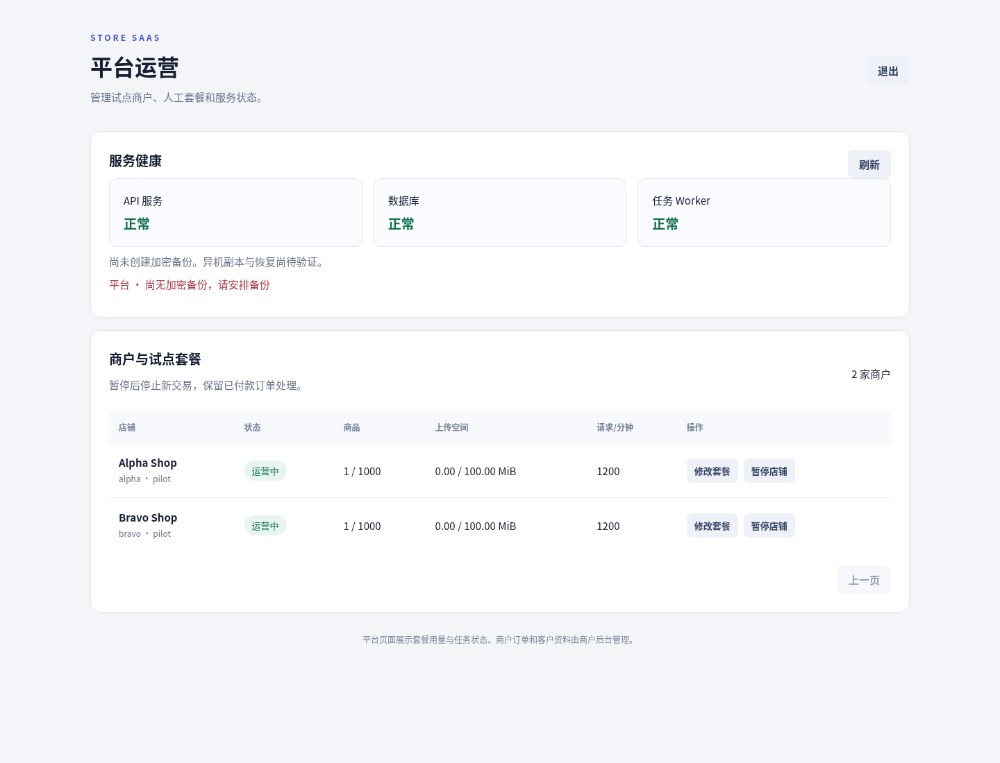
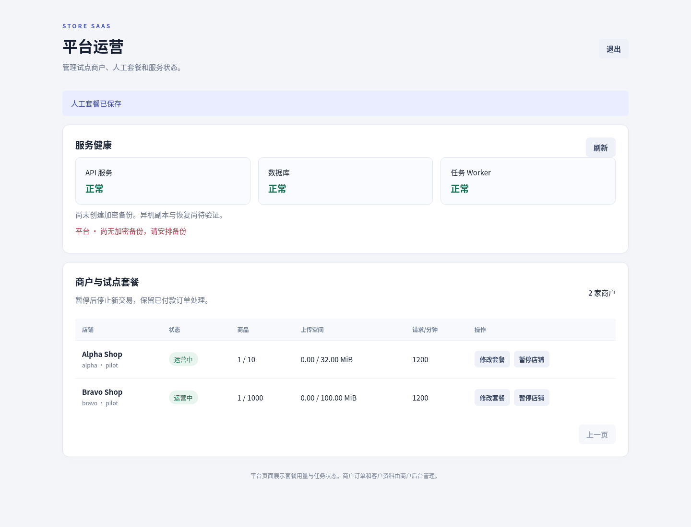
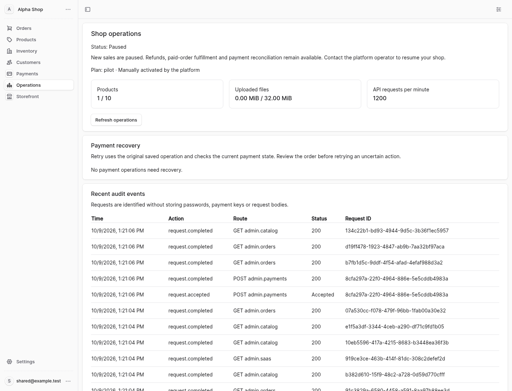
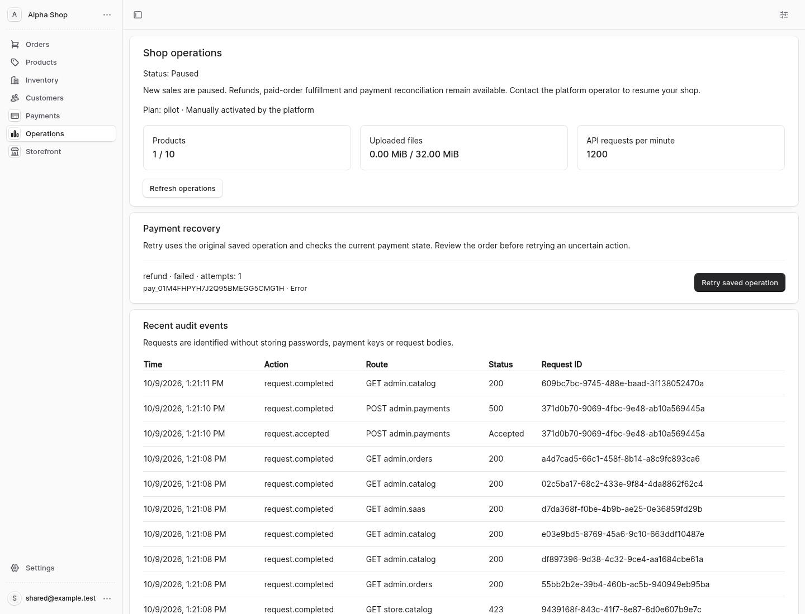
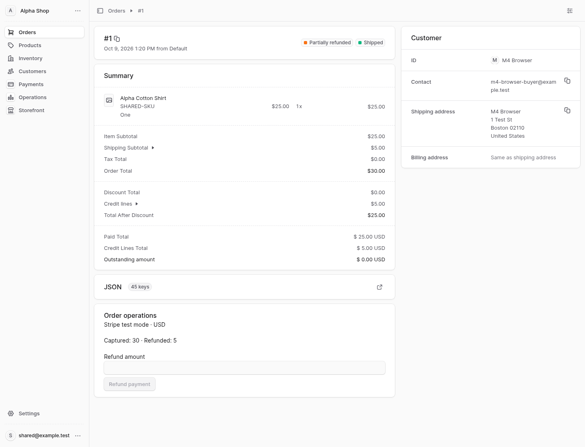
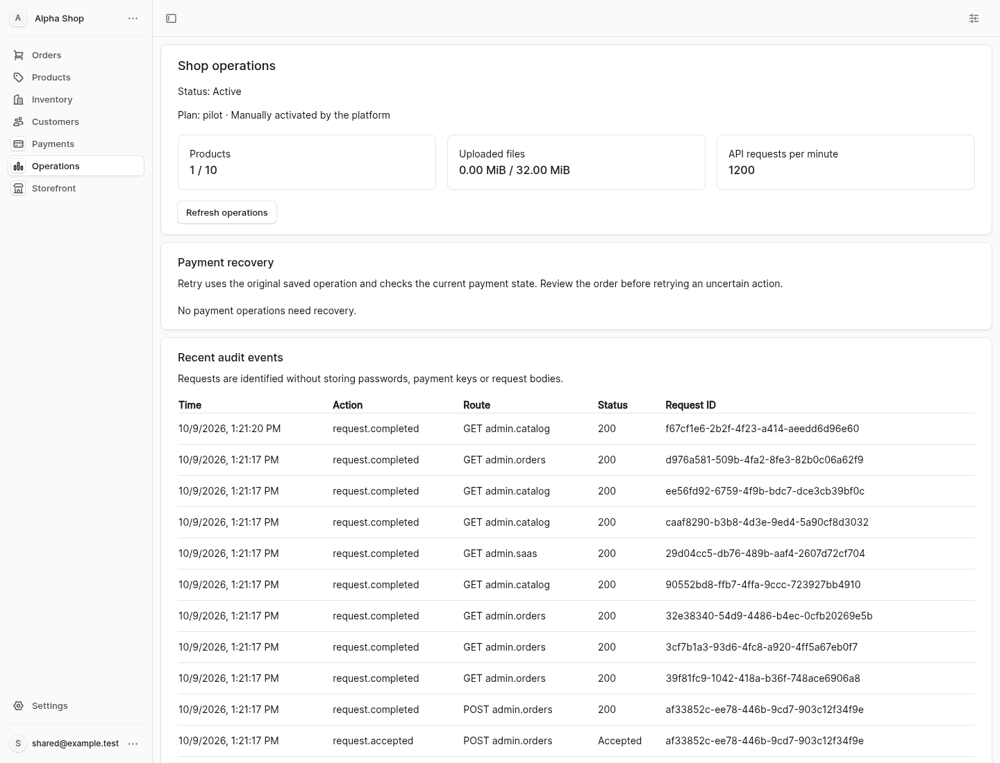

# M5 实施与本地验收

日期：2026-10-09。基线为 M4 提交
`c2f7b1a3412bc222d47b3ca0cd798c4b49795a21`，开发目录
`/workspace/store-saas`，分支 `saas-mvp`。MIT 根许可证、manifest/lockfile、
商城许可证/锁文件及 M0–M4 历史证据保持原值。

## 交付范围与状态

M5 实现平台运营、人工试点套餐、数据库原子配额、暂停后已付款交易处理、
租户限流/队列公平调度、审计和监控、协调清理，以及加密全库/对象/密钥备份恢复。
平台控制台和原生 Admin Operations 扩展是实际服务界面，调用真实 API。
单独商家后台继续暂停；AI、Helpdesk、CRM、营销及行为统计继续第二阶段。

本批属于代码和本地验收交付。独立 PostgreSQL 实例恢复已验证；该实例仍在
同一物理主机。**实际异机复制和异机恢复未验收**，平台接口明确显示此状态。
没有现成备份目标主机、存储目的地或凭据可用于该外部验收；用户已确认目标
尚未准备，真实异机验收列入发布验收。
M4 实际 Stripe 独立测试账户、官方回调和 Elements/3DS 仍待配置。
因此不能将 M5 本地交付解释为完整 MVP 发布完成。

## 已实现行为

| 工作包 | 当前行为 |
|---|---|
| 平台控制 | 指定 platform Host、持久平台身份及 bearer key；分页租户列表；人工修改单一 pilot 配额；暂停/恢复；状态变更与订单动作共用店铺锁 |
| 商品配额 | 默认 1,000 个非软删除商品；原生 INSERT/软删/恢复在 SQL 提交内锁定使用量；并发不会突破最后一个名额 |
| 上传配额 | 默认 100 MiB；保留单对象 5 MiB 上限；先原子预留字节，失败清理未成功仍占额度；对象路径绑定租户 SHA256 命名空间 |
| 暂停 | 关闭新结账、capture 和常规配置写入；店主登录/读取、已付款订单履约/发货、退款/取消和对应签名回调继续 |
| 恢复操作 | 原生后台查看本店不确定支付操作；使用数据库保存的原请求/key 重试；已知 Stripe refund ID 先读取核验，再恢复原生账目 |
| 限流/任务 | DB 分钟窗口；消费者与验证店主独立预算；认证/回调/平台专用限额；逐租户公平领取、金融回调保留容量 |
| 监控/审计 | 实际 worker heartbeat/readiness；失败与积压队列、清理失败、缺失/超过 36h 的本地备份告警；脱敏、追加式租户审计 |
| 清理 | 90 天审计、30 天完成原生事件、过期临时状态和废弃对象预留；全部金融恢复数据及原生工作流检查点保留 |
| 备份/恢复 | 离线、全库和对象、AES-GCM 与 SHA256、密钥恢复、拒绝覆盖；空目标独立实例恢复后以受限角色验证 RLS/归属并恢复退款与签名任务 |

新加法迁移为 `0007-operations`，新增一张 FORCE RLS 的租户审计业务表，
共 **140 张 FORCE RLS 表**；新增六张受限控制表。启动检测实际约束、触发器、
函数及模式指纹，迁移记录本身正确也不能掩盖数据库约束被改动。
旧 M4 应用拒绝 M5 数据库；升级需停止旧写入者，回滚需代码和数据库/对象/密钥匹配。

暂停时固定商城 HTML 返回暂停响应，消费者自己的订单 API 仍可用；商家通过原生
后台处理已付款订单。本批没有额外制作消费者暂停订单门户。
平台只能查看租户元数据和运营指标，不能使用平台 key 读取商家原生订单。
人工开店沿用原有平台创建 API，控制台没有新增收费、自动订阅或开店向导。

## 验证与证据

运行 `SAAS_ARTIFACT_DIR=... bash saas/verify-m5.sh`：先执行 M0–M4 严格回归，
再串行验证 M5 HTTP、升级、备份恢复、真实启动器和生产构建浏览器。
准确通过数、构建检查、冻结哈希和外部待办见
[汇总](m5-evidence/summary.json)；每份文件可按
[SHA256 清单](m5-evidence/SHA256SUMS.json)核对。
M5 `checks` 数为具名业务验收步骤，不等于 Node TAP 测试数量。

关键验收包括：并发配额/软删恢复、上传失败和孤儿回收、暂停后 Stripe 签名
事件及已付款发货/退款、跨租户重试拒绝、公共流量不耗尽店主预算、任务公平领取、
未知命令不能借原生事件恢复机制执行、关闭客户端仍保持实际变更的备份锁。
备份验证包括错误密钥/篡改拒绝、路径穿越/符号链接拒绝、弱 TLS 拒绝、全库行数
与租户配额对照、加密商户配置可用、签名任务恢复和媒体字节一致。

独立恢复对照 **144 张 public 表**的业务行数和控制面租户/使用量；租户请求审计
被恢复后的访问新增，单独验证隔离而不要求恢复后行数恒等。
同一主机独立数据库与实际异机验收分别记录，不能相互替代。

支付使用原生 Medusa Provider、实际 Stripe SDK、自有 loopback 协议 fixture。
浏览器使用生产 Admin/Next 构建、自有 HTTPS 域名和实际 worker。
故障注入的首次退款 500、暂停写入 423、退出平台后 401 为预期结果；没有用
“浏览器零 HTTP 错误”描述这些有意失败的场景。

## 界面

平台控制台：

人工套餐修改：

原生商家后台暂停状态与本店配额：

原生后台恢复不确定退款：

已暂停店铺发货：

本店审计：

截图只保留假数据界面，没有认证 storage state、Cookie、TLS 私钥、数据库转储
或可恢复测试密钥的备份包。平台登录后密钥输入清空。

## 接下来

按 [运维手册](18-OPERATIONS-RUNBOOK.md) 配置安全密钥和真实异机目的地，
执行离机复制/校验/空机恢复演练；记录 RPO/RTO 和渠道对账结果。
M6 继续完整开放入口/隔离矩阵、独立安全审查、依赖/CVE/分发许可、
10 租户与 20 并发参考负载、真实 Stripe 和部署/报警/回滚演练。
当前限额、粗粒度店铺锁和测试数都不是单服务器容量承诺。
